CUDA Rasterizer
===============

[CLICK ME FOR INSTRUCTION OF THIS PROJECT](./INSTRUCTION.md)

* Yi Guo
* Tested on:  Windows 8.1, Intel(R) Core(TM)i5-4200M CPU @ 2.50GHz 8GB, NVIDIA GeForce 840M (Personal Notebook)

### Description
     
This is a rasterizer on GPU. The basic pipeline of vertex shader, primitive assembly, rasterization, fragment shader and frame buffer are implemented. Here are the images and performance analysis of the project.

### ScreenShot

#### Blinning rasterization result

I slight adjust the blinning parameter to make the material some how metallic.
<table class="image">
<tr>
	<td>duck.gltf (Blinn-Phong)</td>
	<td>cow.gltf (Blinn-Phong)</td>
	<td>CeisumMilkTruck.gltf (Blinn-Phong)</td>
</tr>
<tr>
	<td>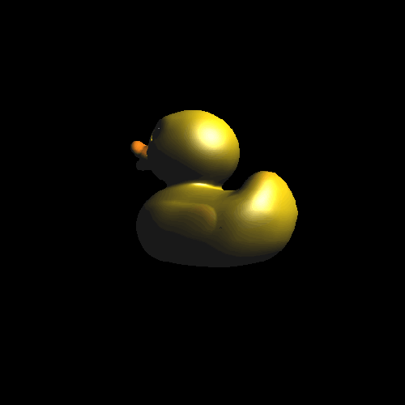</td>
	<td>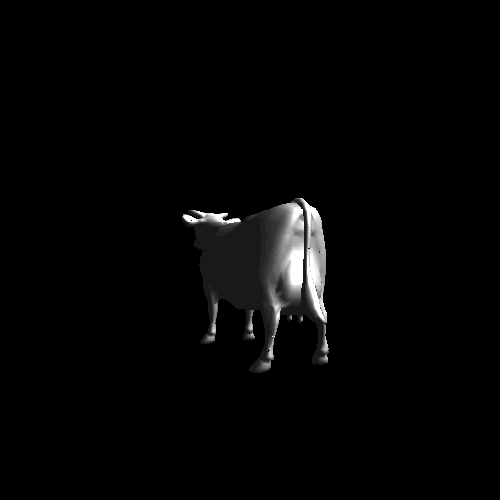</td>
	<td>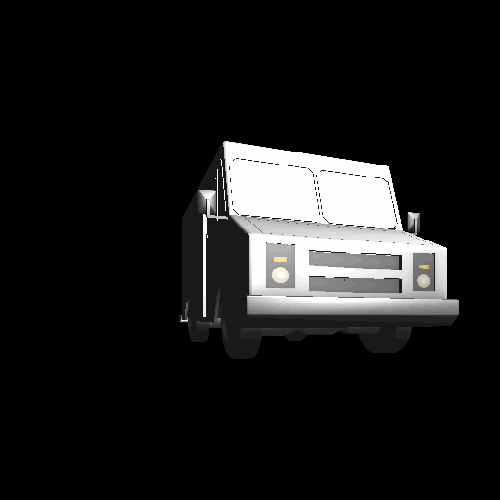</td>
</tr>
</table>

Here are the normal debug mode
<table class="image">
<tr>
	<td>duckNormal.gltf </td>
	<td>cowNormal.gltf</td>
	<td>CeisumMilkTruckNormal.gltf</td>
</tr>
<tr>
	<td>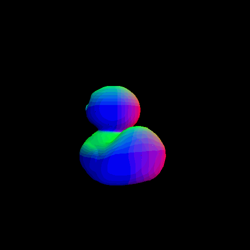</td>
	<td>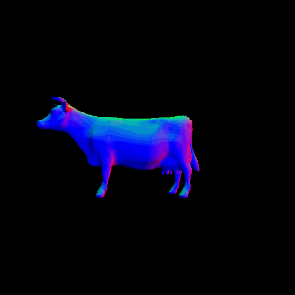</td>
	<td>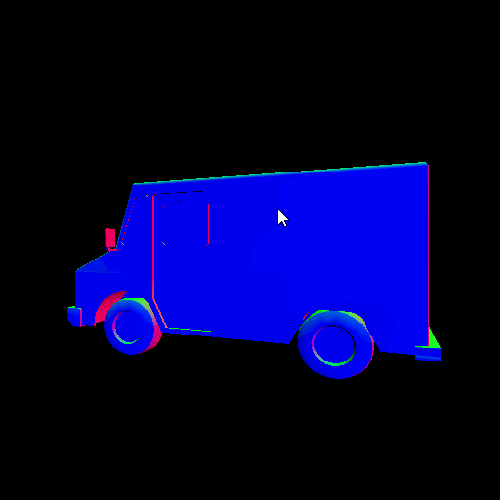</td>
</tr>
</table>

## Performance Analysis

I use the cuda timer to record the time of each process of the rasterization. Here are the graphs.

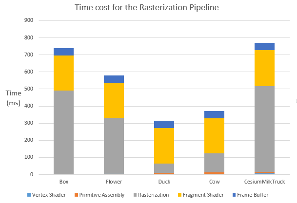

From the graph above, we can notice that the rasterization system spends most time on rasterization and fragment shading. The time cost of vertex shading and primitive assembly is related to the number of triangles of the primitive. However, it is not fair to compare the time cost of rasterization and fragment shading of different models based on the number of triangles they have. Since for the rasterization process, each thread renders a single triangle, so the changes on the number of triangles may not cause great difference on the time cost. What really makes a difference here is the time that each thread spends on rendering a single triangle. The graph below can be a good argument.

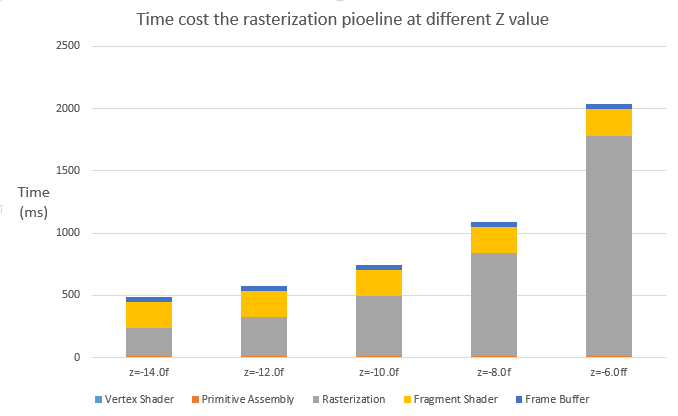

The graph above shows the time cost of a singel model(here I use the CeisumMilkTruckNormal.gltf) with different z values. The z values here mean the distance between the model and camera. As it shows, the time cost of rasterization and fragment shading will increase dramaticlly when the model get closer and closer to the camera. The reason is when the distance between camera and model decreases, each triangle in the primitive will take up more grids on the screen than before and in each thread we have to scan a larger range to render a triangle. 

There are some better solutions for rasterizing a triangle. For each triangle, instead of scanning all the pixels in the bounding box, we can computer the intersection points of each row and triangle's sides and only render the pixel between 2 intersection points. I may implement this algorithm in the future to optimize the rasterization process.

### Extra features

#### Backface Culling

I implment the Backface Culling for the rasterization system. Here is the comparison for the efficiency.

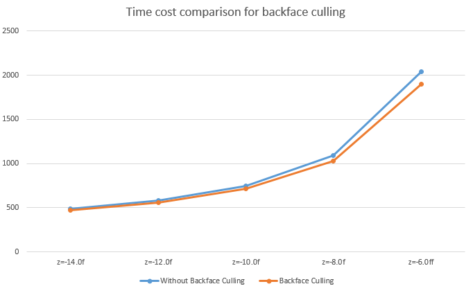

As the graph shows, backface culling may slightly increase the overall efficiency. BackFace culling fliters out the triangles we cannot see, but as we discussed above, the number of triangles is not the main factor of the time cost, thus it cannot cause great difference on the oveall time cost.

#### SSAA(Super Sample Anti-Aliasing)

Supersampling is used to remove aliasing (jagged and pixelated edges). It is achived by rendering the image at a higher resolution than the one being displayed, then shrinking it to the desired size, using the extra pixels for calculation. The color of a pixel in the desired size image equals to the average color values of the corresponding pixels in the higher resolution image. Since we render a image with higher resolution, the rasterize process will be slower.

<table class="image">
<tr>
	<td>SSAA=1.gltf </td>
	<td>SSAA=2.gltf</td>
	<td>SSAA=4.gltf</td>
</tr>
<tr>
	<td></td>
	<td></td>
	<td></td>
</tr>
</table>

#### Perspective Correction

<table class="image">
<tr>
	<td>checkboard NoPerspective</td>
	<td>checkboard Perspective</td>
</tr>
<tr>
	<td>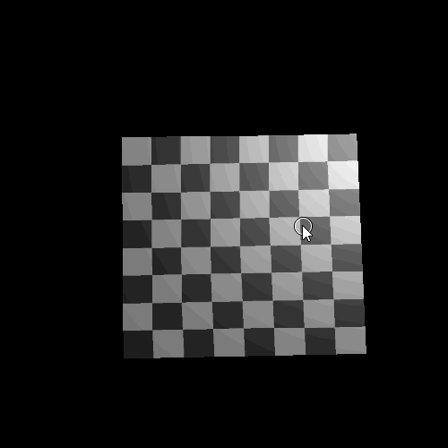</td>
	<td>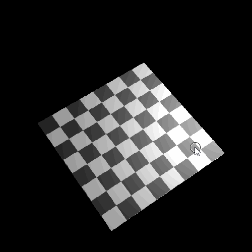</td>
</tr>
</table>

#### Bilinear Interpolation

<table class="image">
<tr>
	<td>No Bilinear Interpolation</td>
	<td>Bilinear Interpolation</td>
</tr>
<tr>
	<td></td>
	<td></td>
</tr>
</table>

#### Different Render Mode(triangle, line ,point)

For the line rendering, I use the [Bresenham algorithm](https://en.wikipedia.org/wiki/Bresenham%27s_line_algorithm)
<table class="image">
<tr>
	<td>duck.gltf (Blinn-Phong)</td>
	<td>cow.gltf (Blinn-Phong)</td>
	<td>CeisumMilkTruck.gltf (Blinn-Phong)</td>
</tr>
<tr>
	<td>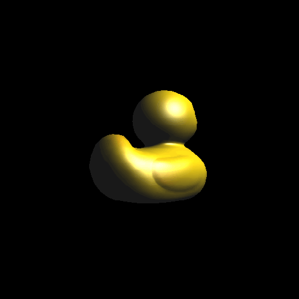</td>
	<td>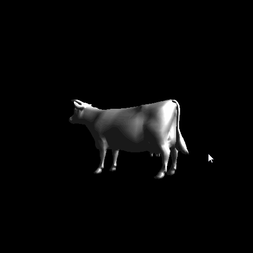</td>
	<td>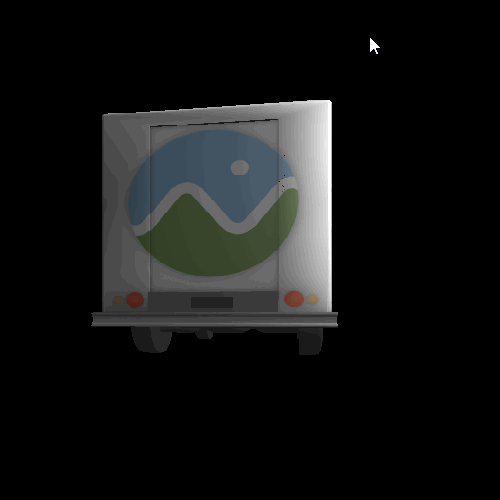</td>
</tr>
</table>

### Credits

* [tinygltfloader](https://github.com/syoyo/tinygltfloader) by [@soyoyo](https://github.com/syoyo)
* [glTF Sample Models](https://github.com/KhronosGroup/glTF/blob/master/sampleModels/README.md)
